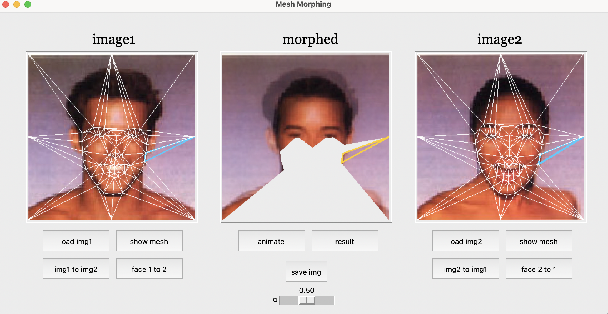
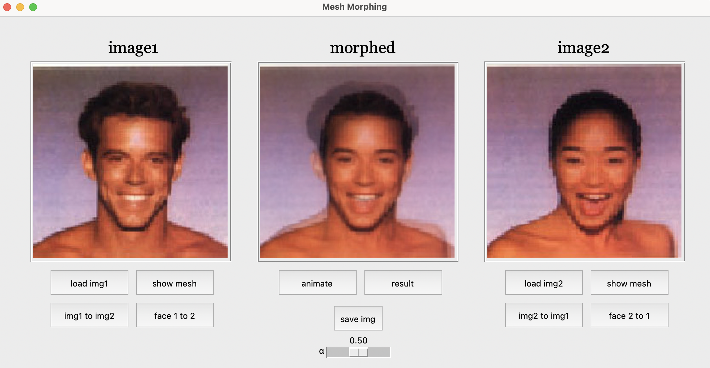
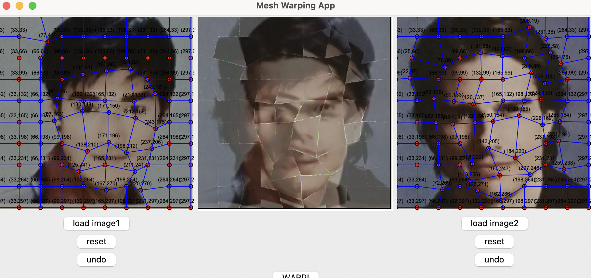
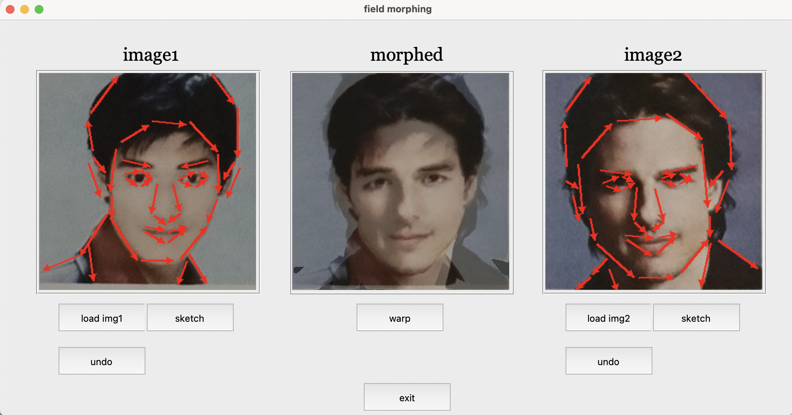
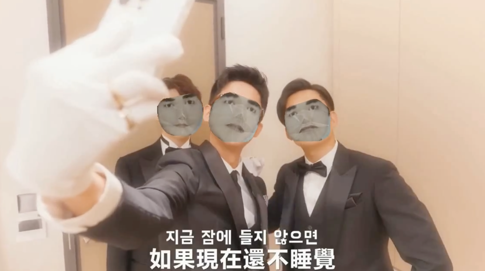

# 2D image Morphing

#### i. meshMorph1.py

- User interface for mesh morphing between two human faces
- Basic operation and process animation
- Triangle-based mesh morphing

#### ii. meshMorph2.py  //failed

- Mesh morphing within rectangles
- User-adjustable mesh points

==> better if mesh be more dense and have proper rectangles mapping

#### iii. fieldMorph.py

- UI for field morphing  
- warping from user-defined feature lines

==> better if more feature lines 

#### iv. faceChange.py

> examele : python faceChange.py img1.jpg dance.mp4
>
> -->the program will ouput dance_output.mp4

- Replace faces in a video with a given face image

- Output the modified video
- Supports only low-resolution face images
- Mesh warping technique

 + 

=  

**Ref** : T. Beier and S. Neely, "Feature-based image metamorphosis," *Computer Graphics*, vol. 26, no. 2, pp. 1-10, 1992.

**Img src** : https://youtu.be/lJZMUQp8EKo?si=ZIPFPFLQkFwybzcw
